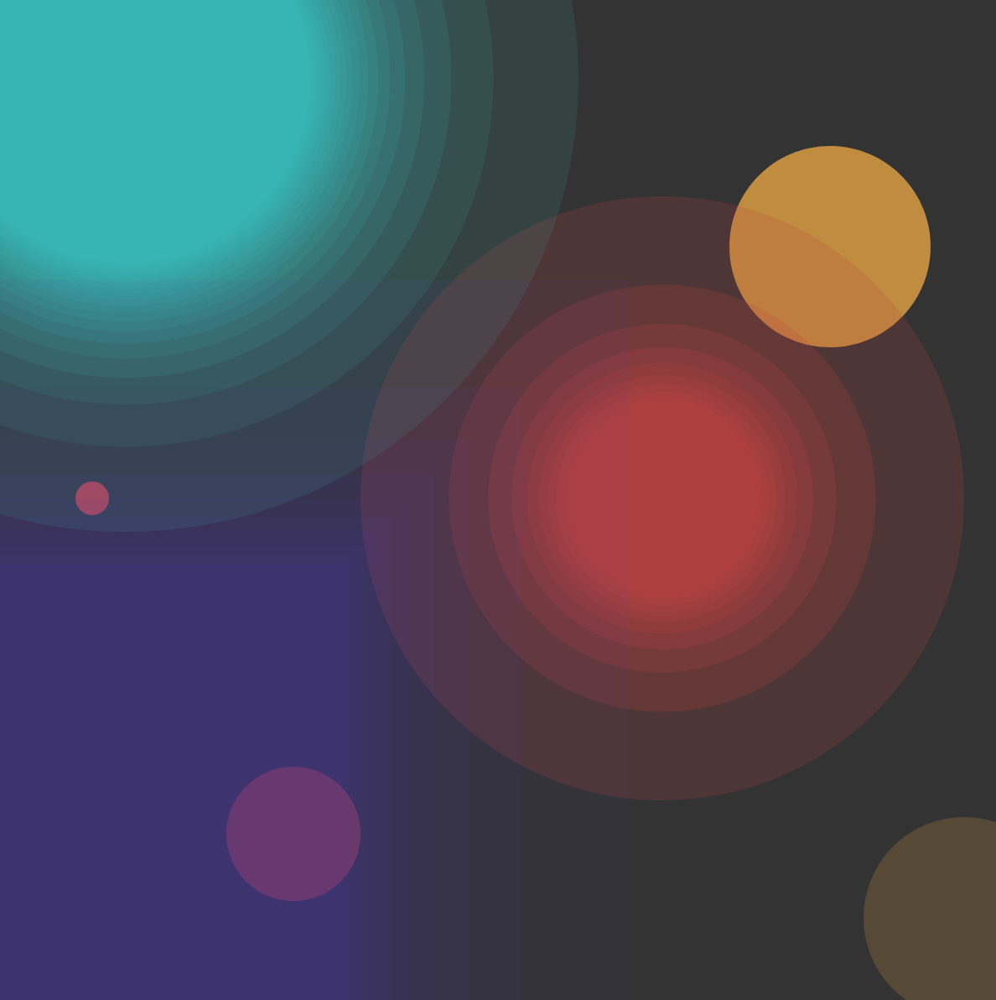

# Journal

## Day 1, January 15, 2019

**11:00 am.** Submitted a bodacious proposal for a talk on interacting with dynamic generative art, not having done any work at all on the project.

**9:30 - 11:30 pm.** Made a start on the project.  Decided to use the `elm-community/typed-svg` library. The first step is to write a small module of functions to draw shapes.  The shapes must be easy to manipulate numerically: easy to translate, change the size, change the color.  So here are the type definitions:

```
type Kind
    = Circle
    | Square


type alias Shape =
    { kind : Kind
    , cx : Float
    , cy : Float
    , r : Float
    , angle : Float
    , h : Float
    , s : Float
    , l : Float
    , a : Float
    }
```

Next, I wrote a rendering function:

```
render : Shape -> Svg msg
render shape =
    case shape.kind of
        Circle ->
            renderCircle shape

        Square ->
            renderSquare shape
```
This can easily be extended to more shapes.

There is a default shape, `Shape.basic` which can be used as a starting point:

```
basic =
    { kind = Circle
    , cx = 10
    , cy = 10
    , r = 10
    , angle = 0
    , h = 1.0
    , s = 0.5
    , l = 0.5
    , a = 1.0
    }
```
This is how I made the first drawing:

```
view : Model -> Html Msg
view model =
    let
        b = Shape.basic
    in
        svg [ viewBox 0 0 300 300 ]
          <|
            [ render { b | kind = Square, cx = 40, cy = 40, r = 80, s = 0, l = 0.2 }
            , render b
            , render { b | kind = Square, cx = 40, h = 0.3 }
            ]
```

Very boring, so let's make something more interesting:



The new element is the function below.  It permits one to make "graded" shapes.  A shape is
repeatedly shrunk by a factor `1/k^e` where `k` runs from `1` to `N` and where the exponent `e` is a number greater than 0.  The smaller it is, the the more slowly the shapes decrease in size. They are stacked one on top of the other with centers aligned.  Thus if they are semitransaparent, color builds up as one goes towards the center.

```
renderGradientShape : Shape -> Int -> Float -> Float -> List (Svg msg)
renderGradientShape shape steps exponent alpha =
    let
        range =
            List.map (\x -> (toFloat x) ^ exponent) (List.range 1 steps)

        shapes =
            List.map
                (\k -> { shape | r = shape.r / k, a = alpha })
                range
    in
        List.map render shapes
```

## Day 2

The goal is to animate the previous day's work in a simple way.  We will do this by scaling each image by a factor `k(t)` which is a periodic function of time with values > 0.  To scale shapes, we introduce a function

```
scale : Float -> Shape -> Shape
scale k shape =
    { shape | r = k * shape.r }
```

Since different shapes have different rendering functions, we introduce some new types to handle this situation:

```
type RenderType
    = R
    | RG Int Float Float


type alias ShapePair =
    ( RenderType, Shape )
```

To transform a `ShapePair`, we use

```
mapPair : (Shape -> Shape) -> ShapePair -> ShapePair
mapPair f ( renderType, shape ) =
    ( renderType, f shape )
```

and to transform a `List ShapePair`, we use

```
mapPairList : (Shape -> Shape) -> List ShapePair -> List ShapePair
mapPairList f listShapePair =
    List.map (mapPair f) listShapePair
```
To animate the artwork, we use this line in the update function:

```
shapeList = Shape.mapPairList (Shape.scale (f 20.0 0.03 model.count)) model.shapeList
```

where

```
f : Float -> Float -> Int -> Float
f angularFrequency amplitude count_ =
    let
        t =
            (toFloat count_) / angularFrequency

        w =
            amplitude * (sin t)
    in
        e ^ w
```

The `model.count` value is provided by a subscription:

```
subscriptions model =
    Time.every 100 Tick
```
